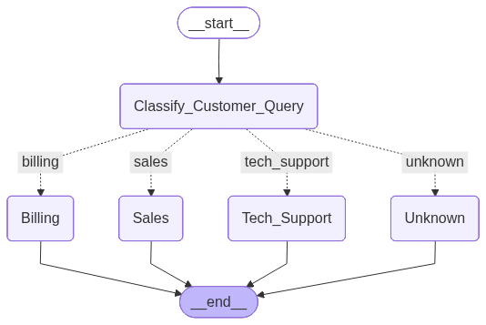

# Customer Support Query Classifier



An AI-powered customer support query classifier built with Streamlit, LangGraph, and Groq. This application automatically classifies customer queries into appropriate departments (Billing, Tech Support, or Sales) and generates contextual responses.

## 🚀 Features

- **Intelligent Query Classification**: Automatically categorizes customer inquiries into Billing, Tech Support, or Sales departments
- **Confidence Scoring**: Displays confidence level for each classification
- **Contextual Response Generation**: Creates department-specific responses tailored to each query
- **Interactive UI**: Clean Streamlit interface with sample questions for easy testing
- **Workflow Visualization**: Visual diagram showing the classification and routing process

## 🛠️ Technology Stack

- **Streamlit**: Powers the interactive web interface
- **LangChain**: Orchestrates the LLM workflow
- **LangGraph**: Manages the state graph for routing queries
- **Groq**: Provides fast LLM inference with Alibaba's Qwen3-32B reasoning model (qwen/qwen3-32b)
- **Pydantic**: Ensures structured data validation

## 📋 Prerequisites

- Python 3.8 or higher
- Groq API key (sign up at [Groq](https://groq.com/))

## 🔧 Installation

1. Clone the repository:
   ```bash
   git clone https://github.com/chaitanyacherukuri/Customer-Support-Query-Classifier.git
   cd Customer-Support-Query-Classifier
   ```

2. Create and activate a virtual environment (recommended):
   ```bash
   python -m venv venv
   source venv/bin/activate  # On Windows: venv\Scripts\activate
   ```

3. Install required packages:
   ```bash
   pip install -r requirements.txt
   ```

4. Set up your Groq API key:
   - Create a `.streamlit` directory if it doesn't exist
   - Inside `.streamlit`, create a file named `secrets.toml`
   - Add your API key:
     ```toml
     GROQ_API_KEY = "your_groq_api_key"
     ```

## 🚦 Usage

1. Start the Streamlit application:
   ```bash
   streamlit run Customer_Query_Classifier.py
   ```

2. Open your browser and navigate to `http://localhost:8501`

3. Enter a customer query or select a sample question to see the classification and generated response

## 🧩 How It Works

The application follows this workflow:

1. **Input**: Customer query is submitted through the UI
2. **Classification**: The query is analyzed by the LLM to determine the appropriate department
3. **Routing**: Based on classification confidence, the query is routed to a specific department handler
4. **Response Generation**: A department-specific response is generated using a tailored prompt
5. **Output**: The classification results and generated response are displayed to the user

## 🏗️ Project Structure

- `Customer_Query_Classifier.py`: Main application file with LangGraph workflow and Streamlit UI
- `requirements.txt`: Python dependencies
- `workflow_diagram.png`: Visual representation of the classification workflow
- `.streamlit/secrets.toml`: Configuration file for API keys (create this file locally)

## 📄 License

This project is available for open use. Feel free to modify and extend it as needed.

---

*This project demonstrates how modern LLM capabilities can be leveraged to improve customer support operations through intelligent query classification and automated response generation.*